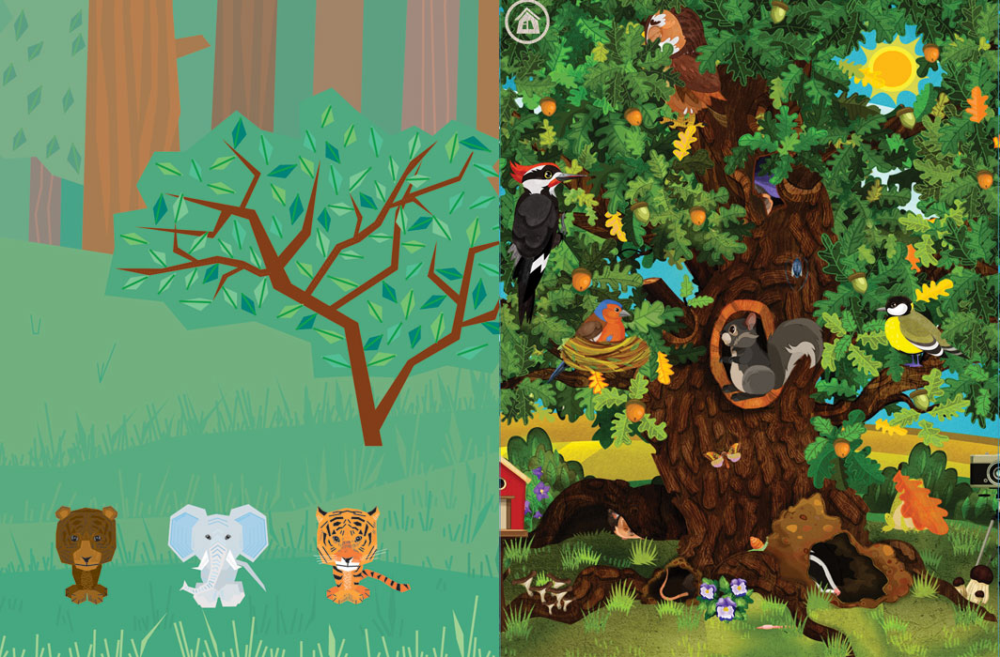

title: Добрый вечер, дамы и господа
tags: 
— мы начинаем КВН
— родной Дубдом
— вам NamNamNam
categories:
— О себе
date:  2014-10-24 23:00:00
---
Как заведует любое приличное общество, начнем мы с себя: DrygzaDruga, или для своих — «Другзадруга», команда неразлучных, интеллигентных и крайне талантливых (в большинстве своем) людей. Мы восхищены возможностями образования и возмущены недостатком внимания к этой сфере. В своих приложениях мы хотим преподнести необычные знания в веселой игровой форме: чтобы в идеале вашему чаду не пришлось выбирать между развлечениями и образованием, потому что последнее будет радовать и захватывать не меньше.

Сейчас мы активно работаем над двумя проектами: эпическим «Дубдомом» и фантасмагорическим NamNamNam. Они весьма часто будут гостить на этих страницах наряду с мировыми новостями, нашими признаниями в любви другим талантливым людям или непременной надиктовкой случайных наборов мыслей. Мы будем стараться, чтобы последних было не так много, как мы любим. Честное слово.

Чтобы не ходить вокруг да насквозь: тизер-картинки обоих приложений, на которые мы способны любоваться бесконечно. NamNamNam сотворила великолепная [Маша Страус](http://mashastraus.com/), Дуб оживляли диво прекрасные [Алена Коробанова](https://www.facebook.com/profile.php?id=100000714355802&fref=ts) и [Катя Веселова](https://www.facebook.com/clawkate?fref=ts).

